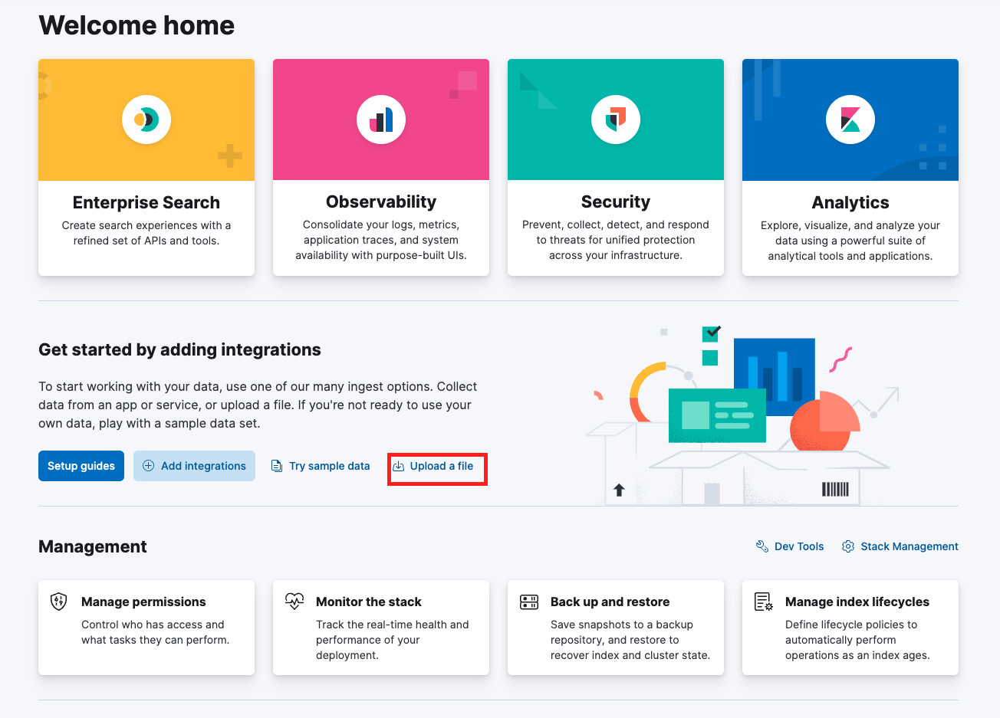

## Importing data



The clean data that has been processed by the [Python Notebook](/0.%20Cleaning%20Data.ipynb) can be uploaded to your elstic couster via the browser interface. 

This step is essential, as this will also create your initial index. 

Make sure your data looks as expected - if a different delimiter was used in the CSV, or if the header is ignored, these settings can be changed. In the end your should have 15 named columns.

Here you can also see some initial statistics for each field, such as unique values and distributions. 


In the next step, import your data and give a useful name to the index. 

For this tutorial I went with:
``` 
hp_ch
```

You can use a different name of course, just make sure to replce ```hp_ch``` with your given index name in the following tutorial steps.

In [Index Mapping](/3.%20Index%20Mapping.md) step we will create a new index from scratch so the name isn't too important until that step.

Also make sure to check ```Create Data View``` as we will be using this in the [Dashboard](/1.%20Kibana%20Dashboard.md) and [Discover](/2.%20Discover%20Queries.md) sections. 

You can also manually create a view by going under ```Stack Management``` at the bottom of your menu options. [See docs](https://www.elastic.co/guide/en/kibana/current/data-views.html)