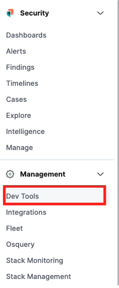

## Index Mapping

Finally, let's get to, you know, search. 

We are no ready to dive into our data and test out the search functionalities. Developers will mostly work in the Console tool, found under the Management tab. From here you can send HTTP requests to Elastic and view the results. We will explore other ways to interact with the Elastic APIs in further blogs.



(link to documentation)

When we uploaded our data to Elastic, we alredy built an index, you can now use a simple GET command to see all documents (or in this case row entries) that have been indexed under "hp_ch". 

```
GET hp_ch/_search
```


This lets us see how each document is stored in the form of a dictionary, starting with the entry for Harry Potter himself, along with other attributes associated with him.

Now let's continue where we left off in our exploration. We noticed in the previous sections that some columns were case sensitive and easier to search yet unavailable to visualize, while others were categorical.

We can take a look at how each field was categorized in the index mapping. Learn more about data types in mappings [from the docs.](https://www.elastic.co/guide/en/elasticsearch/reference/current/mapping-types.html)

```
GET hp_ch/_mapping
```

```json
{
  "hp_ch": {
    "mappings": {
      "_meta": {
        "created_by": "file-data-visualizer"
      },
      "properties": {
        "Birth": {
          "type": "keyword"
        },
        "Blood status": {
          "type": "keyword"
        },
        "Death": {
          "type": "keyword"
        },
        "Eye colour": {
          "type": "keyword"
        },
        "Gender": {
          "type": "keyword"
        },
        "Hair colour": {
          "type": "keyword"
        },
        "House": {
          "type": "keyword"
        },
        "Job": {
          "type": "text"
        },
        "Loyalty": {
          "type": "text"
        },
        "Name": {
          "type": "keyword"
        },
        "Patronus": {
          "type": "keyword"
        },
        "Skills": {
          "type": "text"
        },
        "Species": {
          "type": "keyword"
        },
        "Wand": {
          "type": "text"
        },
        "column1": {
          "type": "long"
        }
      }
    }
  }
}
```

To make searching easier for our particular case, we want to change some of the data types and build a new mapping. There are already some great out of the box choices, like keywords for categorical data like "House", "Eye colour", or "Species". However, Names or Patronus should probably be switched to text, since they can be unique for the wizard and too large of a number to be considered categorical. We'll also convert Birth and Death to dates, and finally, we have "column1" which is the ID remnant of our python cleaning notebook. 

We will build a new index from scratch, create the adequate mapping, and move our data over.

```json
PUT hp
{
  "mappings": {
      "_meta": {
        "created_by": "Iulia Feroli"
      },
      "properties": {
        "Birth": {
          "type": "date",
          "format":"yyyy-MM-dd HH:mm:ss||strict_date_optional_time ||epoch_millis",
          "ignore_malformed": true
        },
        "Blood status": {
          "type": "keyword"
        },
        "Death": {
          "type": "date",
          "format":"yyyy-MM-dd HH:mm:ss||strict_date_optional_time ||epoch_millis",
          "ignore_malformed": true
        },
        "Eye colour": {
          "type": "keyword"
        },
        "Gender": {
          "type": "keyword"
        },
        "Hair colour": {
          "type": "keyword"
        },
        "House": {
          "type": "keyword"
        },
        "Job": {
          "type": "text"
        },
        "Loyalty": {
          "type": "text"
        },
        "Name": {
          "type": "text"
        },
        "Patronus": {
          "type": "text"
        },
        "Skills": {
          "type": "text"
        },
        "Species": {
          "type": "keyword"
        },
        "Wand": {
          "type": "text"
        },
        "column1": {
          "type": "long"
        }
      }
    }
}
```

Finally, we can transfer our data into the new clean mapping. This should make search and visualziation much easier!

```json
POST _reindex
{
  "source": {
    "index": "hp_ch"
  },
  "dest": {
    "index": "hp"
  }
}
```

Now let's see where the magic happens! [Go to Search Magic](/4.%20Search%20Magic.md)