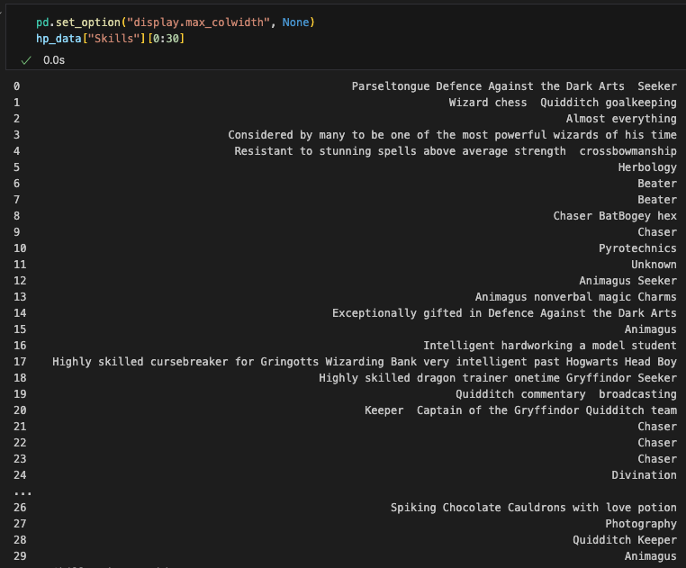

## 4. Search Magic

Hurray, we have a working, clean index! Now what? 

### This is where the magic happens

We can use the console to run queries using the QUERY DSL - a search language made for Elastic.
Using the "match" argument, we can look for values in different fields. By default, multiple terms work with an "or" aggregator, so in the first query bellow we would get a lot of unwanted results if Vldemort's forces also used the term "Army". To be more specific we can explicitly use the "and" operator. 

```json
GET hp/_search
{
  "query": {
    "match": {
      "Loyalty": "Dumbledores Army"
    }
  }
}

GET hp/_search
{
  "query": {
    "match": {
      "Loyalty": {
        "query" :"Order of the Phoenix Hogwarts School Dumbledores Army",
        "operator": "and"
      }
    }
  }
}
```

Naturally the logical next step is to build out this Venn Diagram with th enumber of results we get back. Try to replicate the queries needed to build this.


However, this isn't where our search engine shines. After all you could get these numbers directly from the excel sheet, or all the way in the first step by using a drag and drop dashboard. 
Let's take a look at some more "fuzzy" fields that were too difficult to standardize in the original data cleaning notebook, and build out some increasingly specific searches.



### We can use multi_match to search for various terms across fields 
Result = 29 for quidditch-related wizards

```json
GET hp/_search
{
  "query": {
    "multi_match" : {
      "query":    "quidditch chaser keeper beater seeker", 
      "fields": [ "Job", "Skills" ] 
    }
  }
}
```

### We can use boolean queries to combine different searches
Result = 16 for red & gold quidditch-related wizards


```json
GET hp/_search
{
  "query": {
    "bool": {
      "must" : [
        {
          "multi_match" : {
            "query":    "quidditch chaser keeper beater seeker", 
            "fields": [ "Job", "Skills" ] 
          }
        },
        {
          "match" : {
            "House" : "Gryffindor"
          }
        }
      ]
    }
  }
}
```


### Adding a must-not query for elimination, and a range type for numeric/date variables
Result = 11 gryffindor athletes born after 1980

```json
GET hp/_search
{
  "query": {
    "bool": {
      "must" : [
        {
          "multi_match" : {
            "query":    "quidditch chaser keeper beater seeker", 
            "fields": [ "Job", "Skills" ] 
          }
        },
        {
          "match" : {
            "House" : "Gryffindor"
          }
        }
      ],
    "must_not": {
          "range": {
            "Birth": {
              "lte":"1980-01-01"
              }
          }
        }
    }  
  }
}
```

### And finnaly, we can filter to only allow documents that contain a certain attribute
Result = 3 Red-haired Weasly prodigies 


```json
GET hp/_search
{
  "query": {
    "bool": {
      "must" : [
        {
          "multi_match" : {
            "query":    "quidditch chaser keeper beater seeker", 
            "fields": [ "Job", "Skills" ] 
          }
        },
        {
          "match" : {
            "House" : "Gryffindor"
          }
        }
      ],
      "must_not": {
          "range": {
            "Birth": {
              "lte":"1980-01-01"
              }
          }
        },
      "filter": {
        "term": {
          "Hair colour": "Red"
        }
        
      }
    }  
  }
}
```


These examples cover some common query parameters and combinations, and only scratch the surface of what is possible with a search engine and a small dataset. Keep an eye out for upcoming advanved use cases with Elastic!