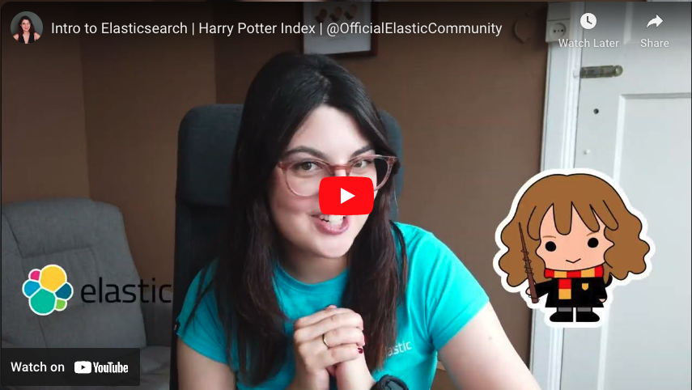

# Harry Potter and the Elasticsearch Engine

This project covers serch use cases on Harry Potter text databases, with a focus on python integrations.

### Part 1: Intro to Elasticsearch [0](/0.%20Cleaning%20Data.ipynb) --> [4](/4.%20Search%20Magic.md)
Create a index where each document is a Harry Potter character with their attributes. This index can them be used to create customized search queries to identify subsets of characters with particular properties.

This example project covers the basic introductory concepts of elasticsearch and kibana. 

<<<<<<< HEAD
### In Phase 2 Notebooks [5](/5.%20Python%20Wrapper.ipynb) --> [9](/9.%20ELSER%20Semantic%20Search.ipynb)
Introduce the python client to communicate with the Elasticsearch engine via code. Create an index from the first Harry Potter movie script to use fore more complex, natural language queries.
Use Hugging Face models to add Sentiment Analysis and Embeddings for Semantic Search.
Combine multiple models for hybrid search; compare to the native functionality of ELSER (knn Search).

### In Phase 3 Files [11](/web_app.py) 
Build a simple Flask APP as a User Interface for search
Introduce a new index to store historical searches as they are ran - we can use this for observability & tracking.
Separate some helper_functions that we can reuse. 
=======
### In Part 2: Python Clients [5](/5.%20Python%20Wrapper.ipynb) --> [9](/9.%20ELSER%20Semantic%20Search.ipynb)
Introduce the python client to communicate with the Elasticsearch engine via code. Create an index from the first Harry Potter movie script to use for more complex, natural language queries.
Import models with the Eland python client allowing us to do sentiment analysis and embeddings.
Use ELSER for semantic search
Combine the different search techniques together

>>>>>>> a22d447f7a6bfb331b7ae5b2d6446ce26b7cabb5

### Implemented features and planned additions
- [X] HP characters index & search
- [X] HP characters index - python client interface for search
<<<<<<< HEAD
- [ ] HP book corpus word2vec embeddings and similairy mapping
- [ ] HP and the Generative AI
=======
- [X] HP sentiment analysis on movie subtitles
- [X] Embeddings and semantic search with ELSER
- [ ] Python-DSL client
- [ ] Observability & Monitoring

>>>>>>> a22d447f7a6bfb331b7ae5b2d6446ce26b7cabb5

## Setup Environment

Requirements
Installation of Elasticsearch (either local or on cloud) [see docs](https://www.elastic.co/guide/en/elasticsearch/reference/current/install-elasticsearch.html)

For python environment, recommend to set up a virtual environment [see docs](https://docs.python.org/3/library/venv.html). 
Requirements: pandas. 

## Harry Potter Characters Index | Intro to Elasticsearch

### [0 Cleaning Data.ipynb](/0.%20Cleaning%20Data.ipynb)
Python notebook for some essential data cleaning with pandas dataframes.

### [0.5 Importing Data](/0.5.%20%20Importing%20Data.md)
Instructinos for adding data to the elastic cluster.

### [1 Kibana Dashboard](/1.%20Kibana%20Dashboard.md)
Short intro to Dashboards and visualizations in Kibana.

### [2 Discover Queries](/2.%20Discover%20Queries.md)
Short intro to Discover and KQL.

### [3 Index Mapping](/3.%20Index%20Mapping)
Working with Console / dev tools, intro to data types in elastic.

### [4 Search Magic](/4.%20Search%20Magic.md)
Building requests and intro to queries.

<<<<<<< HEAD
## Harry Potter Movie Dialoogue Index | Intro to Elasticsearch Python Client
=======
## Harry Potter Movie Dialogue Index | Intro to Elastic Python Client
>>>>>>> a22d447f7a6bfb331b7ae5b2d6446ce26b7cabb5

### [5 Python Wrapper](/5.%20Python%20Wrapper.ipynb)
Working with the python client to build an index and mapping, bulk ingest documents, and run queries.

<<<<<<< HEAD
### 6 TBD - Elasticsearch Python DSL Client

### [7 Eland & NLP](/7.%20Eland%20Client%20&%20%20NLP.ipynb)
Use the Eland client to import models from Hugging Face and run Sentiment Analysis on the data

### [8 Vector Search](/8.%20Vector%20Search.ipynb)
Create embeddings for semantic (natural language) search

### [9 ELSER](/9.%20ELSER%20Semantic%20Search.ipynb)
Compare with the ELSER model built by Elastic

## [10. Christmas Special](/10.%20Christmas%20+%20Books%20Special%20edition.ipynb)
See blog for our Advent Calendar [here](https://discuss.elastic.co/t/dec-18th-2023-en-the-most-magical-time-of-the-year-using-semantic-search-to-find-the-most-festive-harry-potter-moments/347615)

## Phase 3

### [Flask web app](/web_app.py) using [helper_functions](/helper_functions.py) and [templates](/templates/)
Using Flask for a simple user interface allowing users to search (for a live demo). Added historical query tracking in a new index to later use for observability. 

=======
### [7 Eland and NLP - Sentiment analysis](/7.%20Eland%20Client%20&%20%20NLP.ipynb)
Importing models from huggingface using the ELand client. Running sentiment analysis on our index.

### [8 Embeddings and Vector search](/8.%20Vector%20Search.ipynb)
Importing an embedding model and using the vector space to run semantic search.

### [9 ELSER Semantic Search](/9.%20ELSER%20Semantic%20Search.ipynb)
Upgrading semantic search experience with ELSER and combining "classic" elastic searches with sentiment and embeddings for extra dimensions.
>>>>>>> a22d447f7a6bfb331b7ae5b2d6446ce26b7cabb5
